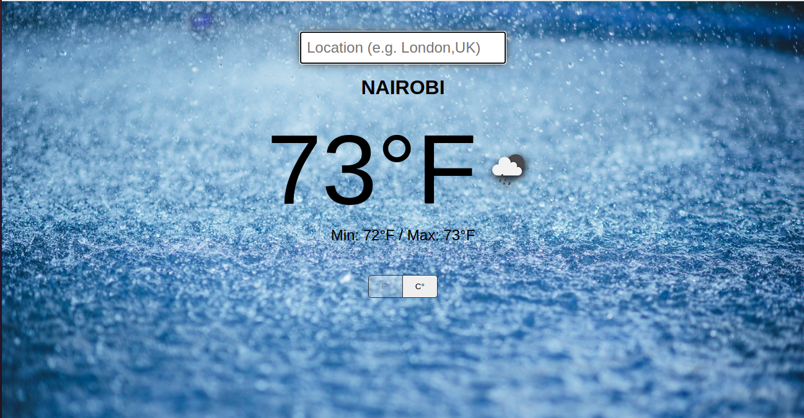

# Weather App



> The main objective for this application is to show how to perform an api call using fetch and also performing asynchronous calls to an api.


## Built With

- HTML
- CSS
- JavaScript
- Webpack

## Live Demo
[Live Demo](https://eager-minsky-b03276.netlify.app/)


### Getting Started
```
Open Terminal
run git clone `https://github.com/KelynPNjeri/Weather-App.git`
Run `dist/index.html`  in your favorite browser.
```


### Deployment

This project has been deployed on Netlify.


## Authors

👤 **Kelyn Paul Njeri**

- Github: [@KelynPNjeri](https://github.com/KelynPNjeri)
- LinkedIn: [KelynNjeri](https://www.linkedin.com/in/kelyn-paul/)


## 🤝 Contributing

Contributions, issues and feature requests are welcome!

## Show your support

Give a ⭐️ if you like this project!

## Acknowledgments

- Microverse
- GitHub
- TheOdinProject
- JavaScript